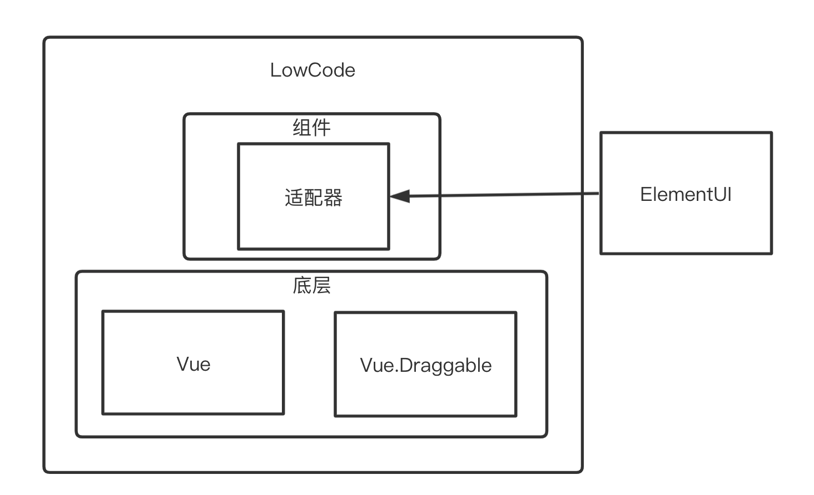
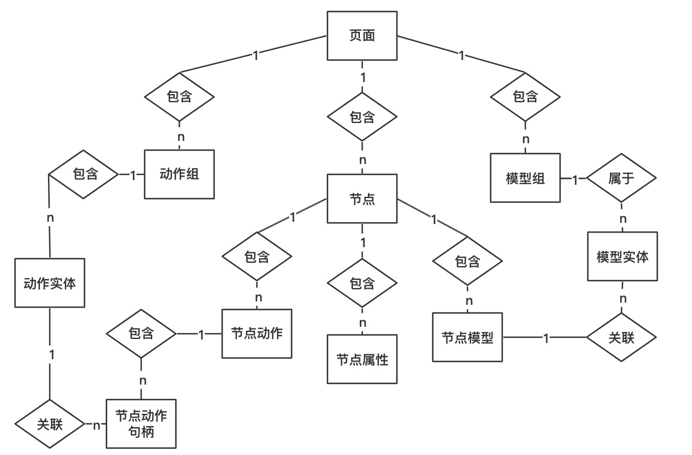
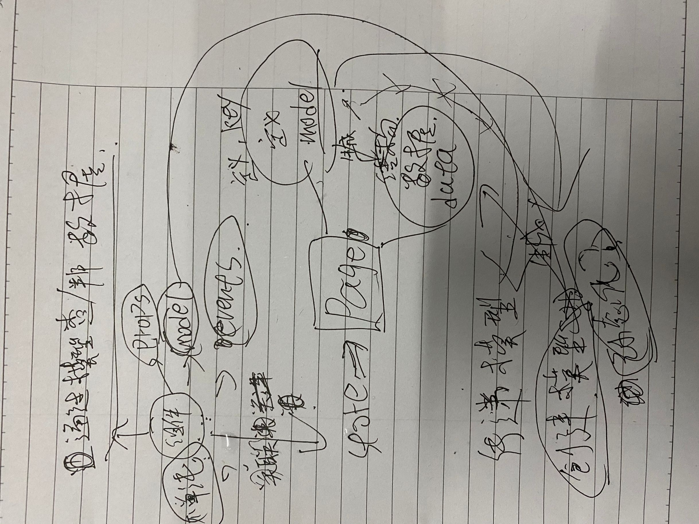

# 又开一坑推荐跨iframe组件拖拽 [d2g](https://github.com/notbucai/d2g)

# Low Code 

个人低代码（可能是伪低代码，毕竟不是很懂）的一个玩具






## 项目依赖

### Vuejs
渐进式 JavaScript 框架

### ElementUI
Element，一套为开发者、设计师和产品经理准备的基于 Vue 2.0 的桌面端组件库

### Vue.Draggable
基于 Sortable.js 的 Vue 拖放组件

## 元素结构
> 使用JSON作为结构化的处理 是不是最终可以抛弃组件库的依赖 只需要做兼容性的 `代理组件`？

```TypeScript
// 分两种 用type作为区分
// 1. 功能元素（组件）
// 2. 容器元素（组件）
type Element = {
  // 唯一ID便于操作 一切以 id 为主
  id: string;
  // (功能 / 容器) 名称
  element: string;
  // 字面意思
  type: 'element' | 'container';
  // props 这里放元素（组件）的 参数
  props?: {
    // 这里由于其他一些问题暂时这样写了
    [key: string]: any;
    [key: number]: any;
  };
  // 容器组件 存放的子元素
  children?: LowElement[];
  models: {
    [key: string]: '[model_key].?[key].?[key]', // key 为自定义
  },
  // 动作，这一块比较复杂
  // 原本设计为[key:value]，由于可能存在描述信息，所以目前改成{xxx}
  actions: [
    {
      key: string, // 随机生成
      // 事件名称 按组件动态创建
      name: string,
      // event: 'click' | 'change' | 'submit', // 对应的可能是 @[event]="" 这个操作
      event?: string, // 目前只有组件中才有意义
      // 动作 目前按同步执行
      handle: [
        {
          key: string, // 随机生成
          name: string,
          // location表示动作存在的位置 一般为element、global, type 表示类型 （如 fetch 发送请求）
          // location 可能还有些复杂的设计 如元素可能绑定一个id，全局中是global_[namespace] 元素中可能是 element_[id]
          // 例子: global_dialog.b2d12 | element_1e4sa.12342
          link: '[location].[key]', // 关联 的触发动作 可能是发送请求 可能是 触发其他元素的动作
          // 这个可用于接口方法和传输 以及 Open dialog
          data?: {
            // 参考 models
            bind?: string, // 绑定的数据源 接口请求、打开dialog或者其他需要数据关联的操作
            recv?: string, // 接受响应的数据源
          }
        },
        // ... more
      ]
    },
    // ... more
  ]
}
```

## 数据源结构

> 模型、类型 的值（默认值） 均为序列数据 需要反序列成对应类型数据

```TypeScript
/**
* 数据类型
*/
types = [
  {
    type: 'string',
    value: '""',
    label: "字符串"
  },
  {
    type: 'number',
    value: '0',
    label: "数字"
  },
  {
    type: 'boolean',
    value: 'false',
    label: "布尔"
  },
  {
    type: 'array',
    value: '[]',
    label: "数组"
  },
];
/**
* 模型
*/
models = [
  {
    name: "表单", // 数据源名称
    key: 'model_1a52926d55f3', // 绑定的字段 该字段创建的时候生成
    // 实体
    entities: [
      {
        key: 'username', // 绑定的字段 输入
        name: "用户名", // 实体名称 输入
        type: 'string', // 数据类型 选择
        value: '""', // 默认值 输入
      },
      {
        key: 'password', // 绑定的字段 输入
        name: "密码", // 实体名称 输入
        type: 'string', // 数据类型 选择
        value: '""', // 默认值 输入
      },
      // ...more
    ]
  }
]

/**
* 数据 通过该 模型生成的结构体
*/
data = {
  model_1a52926d55f3: {
    username: '',
    password: ''
  }
}

/**
* 全局动作
* 用于定义如打开dialog, 发送请求
*/
actions = {
  // namespace为命名空间 一般已经内置命名空间 如 dialog fetch 等
  // 每个命名空间对应一个 解析/执行 器
  [namespace: string]: {
    name: string,
    actions: [
      {
        key: string, // 随机生成
        //  eventName 事件名称 按组件/自定义名称动态创建
        name: string,
        // event: 'click' | 'change' | 'submit', // 对应的可能是 @[event]="" 这个操作
        event?: string, // 目前只有组件中才有意义
        // 动作 目前按同步执行
        handle: [
          // 需要根据解析器具体操作
          // ... more
        ],
        data: {
          bind: '',
          recv: '', // 获取
          replace: [], // 需要取代的值，目前用于数组中（项）的下标
        }
      }
    ],
    // ... more
  }
}
```

## 操作方面

### FIRST 产生的一些问题/想法

采用拖拽的方式，非容器组件不能存在其他组件，指定组件只能存在指定组件中？  
点击元素进行一些数据关联、属性增删、事件监听？  

突然发现嵌套关系应该有祖先关系的 比如 `el-form-item` 只要在 `el-form` 的子孙就行  

固定画布元素避免匹配排序问题   

拖动节点的时候带走子孙节点 间接导致出现的问题

最终还是需要模版化才是最优的

历史栈/快照  

多Slot的情况  

实际上从待定组件列表中拖动到画布中的时候有些待定组件的属性应该去除或者更改  

必须有一个可以选择边距的元素才行  

### NEXT 产生的问题/想法

想这个的时候脑子爆栈了, 所以用笔辅助了一下，字很差，看个灵魂就好。
  

感觉操作逐渐复杂起来  

感觉还得有个替换父级的功能  

  
需要做到职责分明  
如果提交、重置应该放在表单  
表格只需要绑定数据源剩下数据应该由其他相关事件获取（如分页操作、搜索、初始化）  

所以表单完成后需要一些操作如清空表单、更新数据源     

一个接口可以对应多个数据源  

数据源添加/设置中模型可能会有点问题，

数据源的序列数据 目前使用JSON进行序列还存在一些问题。

页面管理基本完成

### 动作

一、类型  
1. 组件创建进入获取初始化数据
2. 增删改，分页
3. 弹框 
4. 表单提交    
5. 页面跳转 可能带参数

二、其他
1. 时机   无非分为多个动作
2. 动作   无非是（操作/提交）数据源 和 API调用

## 进度

### ✅ FIRST 生成前端代码

目前正在做第一步，生成Vue代码。  
预计 `十月底` 完成。

> 目前进度：   
> 1. 拖拽使用`Vue.Draggable`库基本功能完善  
> 2. 丰富 `代理组件` 便于以后解耦  
> 3. JSON 转换成Vue + element 组件代码

### 🙆 NEXT ING

预计`十一月中旬`动工 （有些个人的事情要处理）

1. 数据源 （用于表单数据绑定）   
2. 事件  
3. 简单关联的接口
4. 权限
5. thinking
